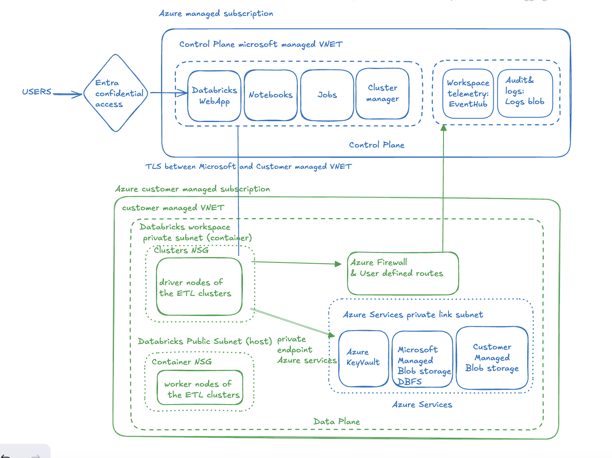
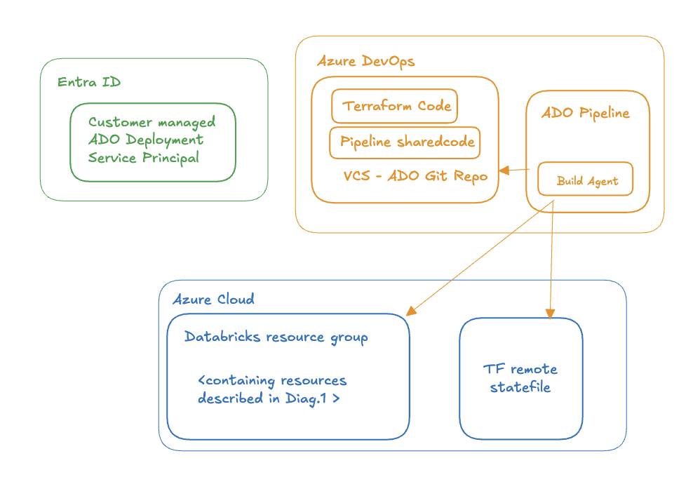

# secure-databricks-deployment

The following repository contains Azure Databricks design document implementing enterprise-grade security solutions.

# Table of Contents

- [Secure Azure Databricks Deployment](#secure-azure-databricks-deployment)
  - [Networking](#networking)
  - [Access](#access)
  - [Secrets](#secrets)
  - [Data Encryption](#data-encryption)
  - [Monitoring](#monitoring)
  - [Disaster recovery](#disaster-recovery)
- [Secure a CI/CD Pipeline Deploying Infrastructure to production](#secure-a-cicd-pipeline-deploying-infrastructure-to-production)
- [Threat Detection & Response](#threat-detection--response)
- [Limitations](#limitations)

# Secure Azure Databricks Deployment

*Diagram 1 - Databricks architecture*

## Networking
Databricks deployment shall follow hub-spoke network design which prevents public IP assignments exposing cluster nodes to the internet. Hub VNET centralizes shared azure services related to e.g. monitoring, firewall. Spoke VNET aggregate workload related resources, like e.g. Databricks ETL or DS clusters. Between hub and spoke VNETs there should be peering configured. Network used for Databricks data plane shall be isolated to prevent unauthorized access and restricts virtual machine access by disabling SSH and enforcing security baselines. Dynamic IP allowlists shall be used to ensure access to corporate networks is limited for Databricks workspace. NSG configurations for the private subnet allow only internal traffic from the control plane and VNet-injected resources, while public subnet NSGs enforce Databricks-specific port requirements (443 inbound from control plane). 

Key considerations:
- Implement hub-spoke network design, hub VNet handles central connectivity and security controls, spoke VNet contains the Databricks workspace with private connectivity,
- Deployment of Databricks workspace in own virtual network (Virtual Network injection) serving here a role of spoke VNET with Azure Private Link which ensures that connections between users, compute resources and services provided by Azure remains private, doesn't require exposing traffic to the public internet,

## Access
Access management shall leverage Microsoft Entra ID which allows to setup single sign-on and credential passthrough. This approach eliminates the need to use service principals for access. On top of that use of Unity Catalog helps to centralize governance across workspaces. It also allows fine-grained access controls, data lineage tracking. In case necessary it also supports multi-cloud scenarios. Workspaces, compute resources, and data are not allowed for public access.

Key design considerations:
- Microsoft Entra ID for credential passthrough,
- Setup of SSO with Microsoft Entra ID and Conditional Access policies for enhanced security.
- use Azure Active Directory (AAD) tokens to utilize the non-UI capabilities of your Azure Databricks workspace
- Least Privilege Access: Use Unity Catalog for fine-grained access control to data assets.

## Secrets
Azure Key Vault shall be used for secrets management. It shall store secrets used in the deployment process e.g. ARM client credentials used by the pipeline, API keys required for integration with external services, certificates and storage account encryption keys.

## Data encryption
Bring Your Own Key shall be implemented with customer managed keys used for encryption at rest for following components:
- Notebooks and workspace metadata
- DBFS root storage
- managed disks

While this makes the solution more complex use of customer managed keys provides an additional layer of security to the platform ensuring data can be only accessed with the key that is under organisation control (in contrary to platform managed keys which are controlled by vendor).

Encryption keys will be rotated periodically to mitigate risks associated with key compromise.

Note: Key rotation can be automated using Azure Key Vault auto-rotation option. 
Requirements to enable this feature is to use RSA-HSM keys (2048/3072/4096-bit). Key Vault shall also have Key Vault Crypto Officer role for rotation.

### Environment isolation
In order to ensure that there is a clear separation between environment levels as Development, Testing and Production each environment shall utilize separate Azure Databricks workspaces with dedicated VNets, preventing network-level access between environments. 

Production environments shall implement strict access controls through Conditional Access policies as e.g. multi-factor authentication in Microsoft Entra ID and restricting access to managed devices. 

On the data level Unity Catalog's multi-catalog approach shall be leveraged, using environment-specific catalogs with separate storage locations to ensure data separation. 
CI/CD pipelines enforce approvals and validation gates for promoting changes across environments, with production deployments requiring additional security reviews.

### Monitoring
For monitoring purposes Databricks diagnostic logs shall be streamed to Azure Monitor. Network traffic logs are captured through NSG flow logs and Azure Firewall logs with 90-day retention for forensic purposes.Retention period shall be set to 90 days. In order to meet compliance a cold storage archiving can be implemented for longer periods.
It is vital to build custom dashboards collection key operational metrics as job execution succes rates and speed, cluster performance (CPU and memory metrics).
Alert based on metrics shall be configured with escalation paths to appropriate teams. Examples of alerts - cluster performance lowered due to underscaling, job execution success rate dropped below expected treshold. 

### Disaster recovery
A disaster recovery strategy shall be defined to ensure business continuity. Make sure that Recovery time objective is set taking into account criticality of data pipelines. Disaster recovery plan shall include failover procedures with predefined reponsibilities and communication protocols.

Databricks related resources and configuration as notebooks, jobs and pipeline definitions shall be versioned using Databricks Repos or version control system in order to be able to reuse the code in case of recovery.

## Secure a CI/CD pipeline deploying infrastructure to production
Deployment of the solution is based on Terraform Infrastructure as code and Azure native CI/CD - Azure DevOps deployment pipeline. Azure DevOps pipelines were chosen here as they offer better integration with Entra ID and are offer more granular control over RBAC capabilities. On top of that ADO offers native Azure Key Vault integration for secrets management which is crucial when interacting with secrets used for the deployment.

*Diagram 2 - Deployment topology*

Key considerations:
- Terraform with Databricks asset bundles for workspace/cluster provisioning.
- Terraform code should be versioned using VCS like GitHub, Bitbucket or Gitlab.
- Terraform backend state file should be managed remotely, using Azure blob storage (for local use it can be configured with a backend.tf file as in example)
- Azure DevOps deployment pipeline shall use a custom deployment Service Principal which is assigned  permissions required to deploy Azure services to Azure subscription, following least privilege principle,
- Azure DevOps pipeline shall be a multi-stage one, containing a manual verification step before the deployment to production environments to ensure applied changes are not going to affect system availability and are compliant (review process in place),
- Resources deployed with Terraform should have tags clearly reflecting ownership and environment level,

Exemplary ([ADO pipeline code](https://github.com/piotr-muzyka/secure-databricks-deployment/blob/develop/azure-pipelines.yaml)) enclosed in the repository.
Exemplary Terraform code included in the repository. 
Tested with terraform 1.5.7, azurerm v3.117.1

## Threat detection & response
For security auditing Azure Databricks Logs shall be used. They capture privileged activities, file access, workspace modifications, cluster resizing, and file-sharing activities enabling monitoring of workspace access and user actions. In terms of Threat detection it is vital to focus on file integrity, unusual user activity and changes around permissions. 
Audit logs can be then streamed to Azure Sentinel for SIEM integration. For egress traffic monitoring Azure Firewall logs shall be used.

Example of use cases to implement for threat detection:
- Unusual user activity:
  - failed login attempts
  - impossible travel (switches between geo locations in short time)
  - abnormal API call frequencies
- File Integrity Monitoring
  - unauthorised file modifications
- Permission and configuration changes
  - privilege escalation attempt 

Suggested response for the use cases mentioned above:
- Unusual user activity:
  - verify activity logs to confirm malicious activity and lock the account to contain the issue. Perform investigation on the malicious activity and make corrective decisions based on it (e.g. rework Entra ID configuration)

- File integrity monitoring: 
  - Isolate the affected resource from the network to prevent lateral movement. Review network configuration around the affected resources. 

## Limitations:
-  It is not possible to replace an existing VNet in a workspace with another one, if it was necessary to create a new workspace, a new VNET must be created.
- It is not possible to add SCC to the workspace once it has already been created, if it was necessary, the workspace must also be recreated
- Potential challenges in managing multiple workspaces under Unity Catalog governance.